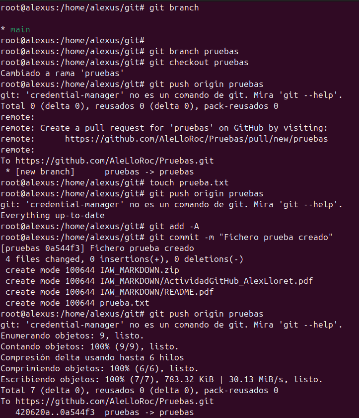
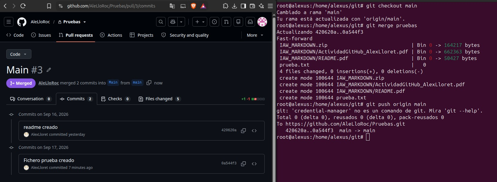

# Práctica 1: Git - Ramas y uniones

## 1. Creación de la rama `pruebas`

Primero comprobamos las ramas disponibles en el repositorio:

~~~bash
git branch
~~~

Comprobamos que estamos en la rama principal `main`. A continuación, creamos una nueva rama llamada `pruebas` y cambiamos a ella:

~~~bash
git branch pruebas
git checkout pruebas
~~~

Después subimos la nueva rama al repositorio remoto:

~~~bash
git push origin pruebas
~~~

## 2. Creación del archivo y realización del commit

Dentro de la rama `pruebas`, creamos el archivo `prueba.txt`:

~~~bash
touch prueba.txt
~~~

Añadimos los cambios al área de preparación y realizamos un commit:

~~~bash
git add -A
git commit -m "Fichero prueba creado"
~~~

Finalmente, subimos los cambios de la rama al repositorio remoto:

~~~bash
git push origin pruebas
~~~

## 3. Unión de la rama `pruebas` con `main`

Una vez terminados los cambios, volvemos a la rama principal:

~~~bash
git checkout main
~~~

Realizamos la unión de la rama `pruebas` con `main`:

~~~bash
git merge pruebas
~~~

En este caso, Git realiza la unión mediante **Fast-forward**, ya que no existen cambios incompatibles entre las dos ramas.

Finalmente, sincronizamos la rama `main` con el repositorio remoto:

~~~bash
git push origin main
~~~

## 4. Conflictos de fusión

También se ha trabajado con los **conflictos de fusión**, que aparecen cuando dos ramas modifican la misma parte de un archivo de forma diferente. En estos casos, Git no puede realizar la unión automáticamente y es necesario resolver el conflicto manualmente.

Una vez solucionado el archivo afectado, se añaden los cambios y se realiza un nuevo commit:

~~~bash
git add .
git commit -m "Resolución de conflicto"
~~~

## 5. Eliminación de ramas

Cuando una rama ya no es necesaria, puede eliminarse después de haber realizado su unión con la rama principal:

~~~bash
git branch -d [rama]
~~~

## 6. Conclusión

En esta práctica se ha aprendido a trabajar con **ramas en Git**, crear y gestionar diferentes líneas de desarrollo, realizar commits, sincronizar los cambios con GitHub y fusionar ramas mediante `merge`.

También se han trabajado los **conflictos de fusión**, aprendiendo a identificarlos y resolverlos manualmente para completar correctamente la unión de las ramas.
