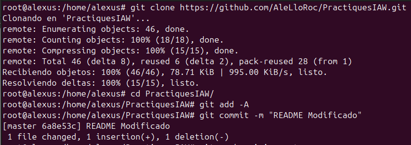
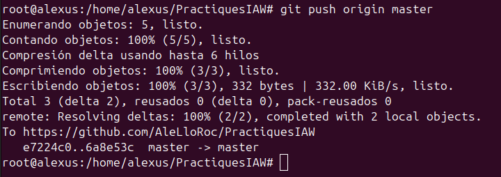
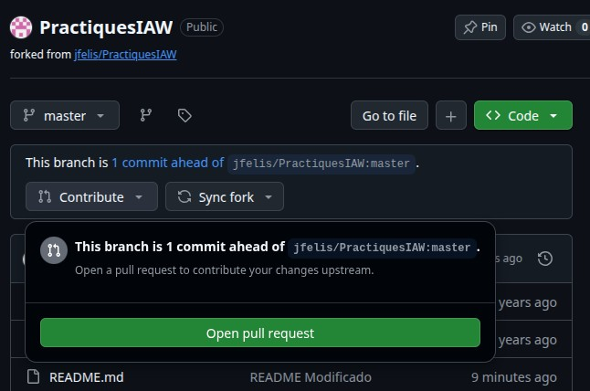
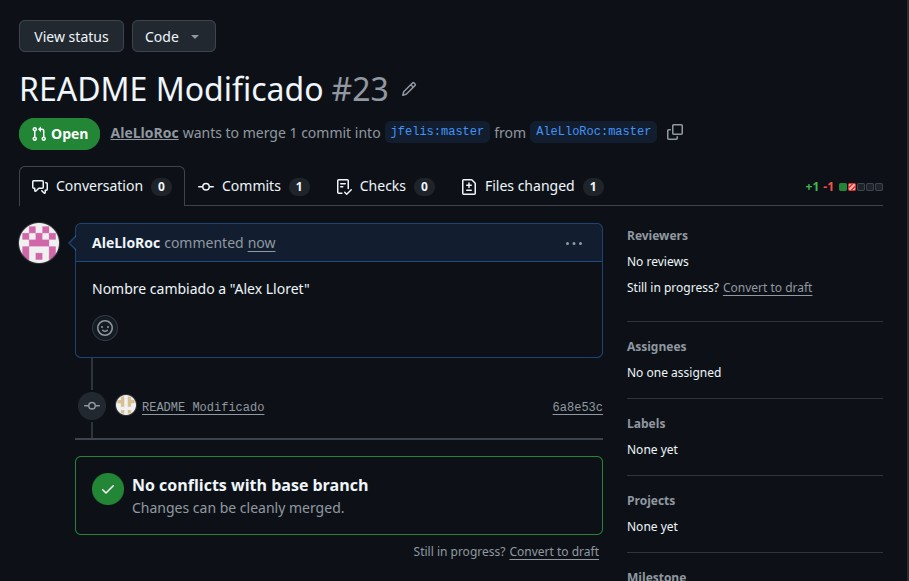

# Práctica 2: Pull Request

## 1. Clonación del repositorio

Primero clonamos nuestro repositorio de GitHub en el equipo local:

~~~bash
git clone https://github.com/AleLloRoc/PractiquesIAW.git
~~~

Después accedemos al directorio del repositorio:

~~~bash
cd PractiquesIAW
~~~

## 2. Modificación del archivo `README.md`

Una vez clonado el repositorio, modificamos el archivo `README.md`.

En este caso, se realiza un cambio en el nombre que aparece en el archivo, pasando a mostrar **Alex Lloret**.

Después de realizar el cambio, comprobamos las modificaciones y las añadimos al área de preparación:

~~~bash
git add -A
~~~

## 3. Creación del commit

Una vez añadido el cambio, realizamos un commit con un mensaje que indique qué se ha modificado:

~~~bash
git commit -m "README Modificado"
~~~

El commit registra el cambio realizado en el repositorio local.

## 4. Subida de los cambios a GitHub

Después del commit, subimos los cambios a la rama `master` del repositorio remoto:

~~~bash
git push origin master
~~~

El resultado muestra que los cambios se han enviado correctamente a GitHub:

~~~text
master -> master
~~~

## 5. Creación del Pull Request

Una vez subidos los cambios, GitHub muestra que nuestra rama está **1 commit por delante** del repositorio original.

Desde el botón **Contribute** seleccionamos la opción para abrir un nuevo Pull Request:

~~~text
Contribute → Open pull request
~~~

## 6. Pull Request

Al crear el Pull Request, se muestra el cambio realizado en el archivo `README.md`.

En este caso, el Pull Request se titula **README Modificado #23** y solicita incorporar el commit realizado desde `AleLloRoc:master` hacia `jfelis:master`.

También se puede observar que no existen conflictos con la rama principal:

~~~text
No conflicts with base branch
Changes can be cleanly merged.
~~~

## 7. Conclusión

En esta práctica se ha realizado el proceso completo para crear un **Pull Request** en GitHub. Primero se ha clonado el repositorio, después se ha modificado el archivo `README.md`, se ha creado un commit y se han subido los cambios al repositorio remoto.

Finalmente, se ha utilizado GitHub para crear el Pull Request y solicitar que los cambios realizados se incorporen al repositorio original.
