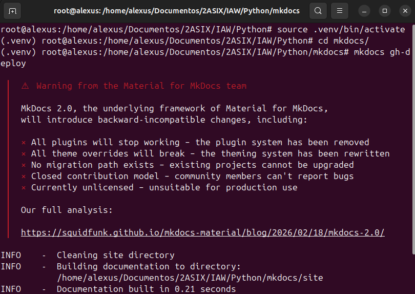
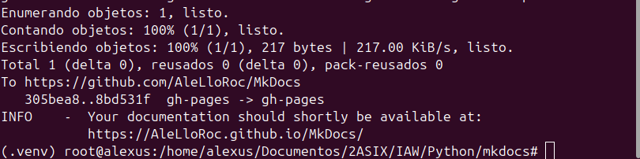
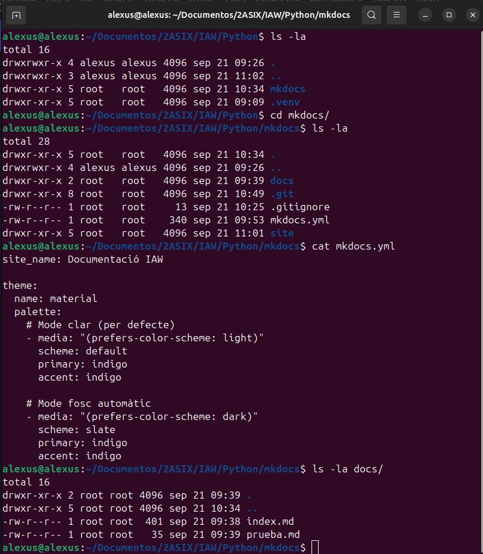

# Práctica 3: MkDocs, Material y GitHub Pages

## Enlaces del proyecto

* **Repositorio de GitHub:** https://github.com/AleLloRoc/MkDocs
* **Sitio web publicado (GitHub Pages):** https://alelloroc.github.io/MkDocs/

---

## 1. Creación y configuración del entorno virtual

    python3 -m venv .venv
    source .venv/bin/activate
    python -m pip install mkdocs-material
    mkdocs --version

---

## 2. Creación y estructura del proyecto

    mkdocs new mkdocs
    cd mkdocs

Añadido a `.gitignore`:

    .venv/
    site/

---

## 3. Redacción de la documentación

Edición de `docs/index.md` y creación de archivos `.md` adicionales.

---

## 4. Configuración del tema Material

Configuración de `mkdocs.yml` aplicando el tema `material` y la paleta de colores para modo claro y oscuro automático según las preferencias del sistema.

---

## 5. Previsualización y generación del sitio web

    mkdocs serve
    mkdocs build

---

## 6. Publicación en GitHub Pages

    mkdocs gh-deploy

Comprobación en GitHub (**Settings → Pages**) seleccionando la rama `gh-pages` y la carpeta `/(root)`.

